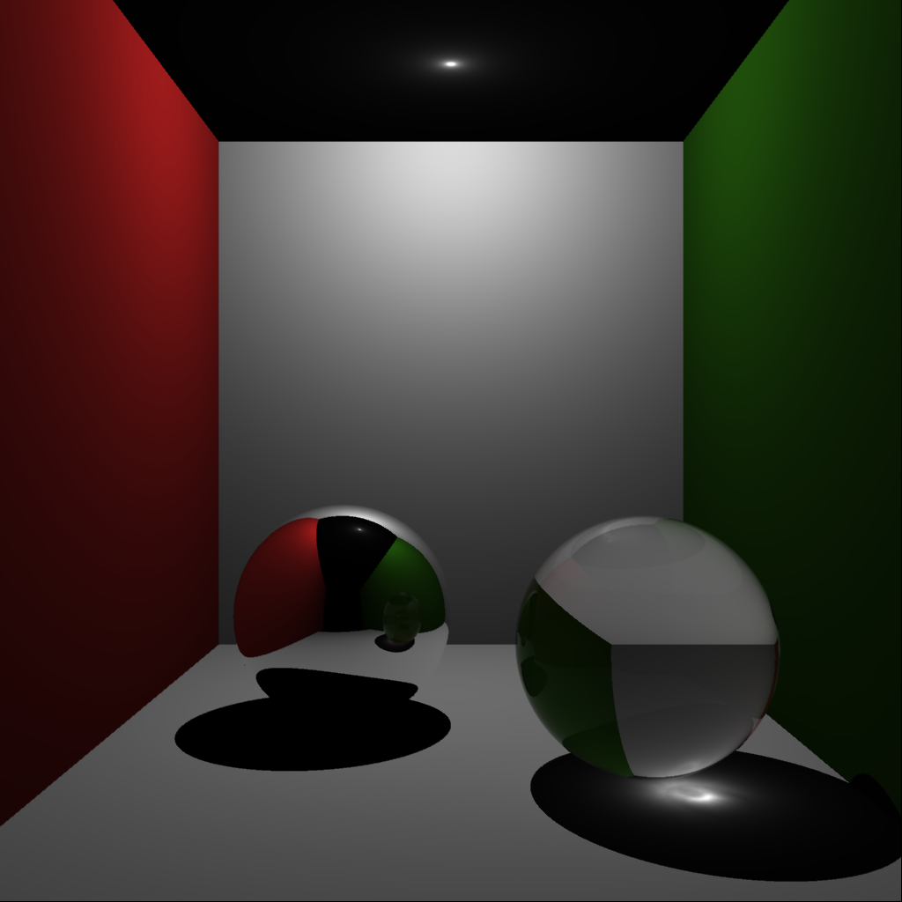

# RayTracer
## Feature Demos
### Caustics (using Photon Mapping)

### UV Mapping

### Adaptive Anti-Aliasing

## Building
Run `premake4 gmake` followed by `make`.

## Running
The program needs the path to a Lua file that describes the scene to render. 
The scene files are under the `./Assets` directory.
Navigate to `./Assets` and run `../RayTracer <lua-file>`.
